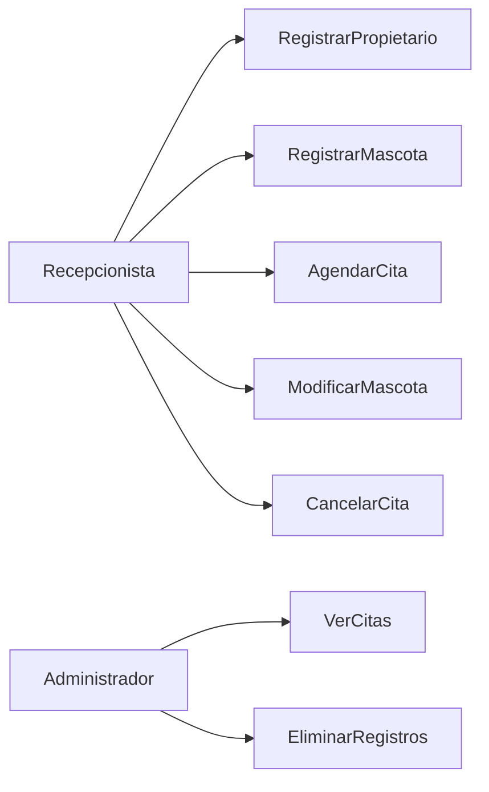

## Diagrama de Casos de Uso

```mermaid
flowchart LR

Recepcionista --> RegistrarPropietario
Recepcionista --> RegistrarMascota
Recepcionista --> AgendarCita
Recepcionista --> ModificarMascota
Recepcionista --> CancelarCita

Administrador --> VerCitas
Administrador --> EliminarRegistros
```

Este diagrama representa las principales acciones que pueden realizar los usuarios del sistema de la clínica veterinaria.
